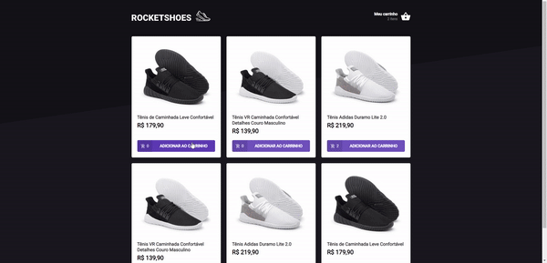

  

## Sobre 📖
Aplicação realizada como desafio do Chapter II do Ignite da Rocketseat, uma página de um site de compra de tênis. 

Nesse desafio podemos adicionar compras ao nosso carrinho e temos a página de checkout onde também podemos adicionar e retirar itens do nosso carrinho

## Desafios 🏆
  - [x] Mostrar no header quantos itens distintos temos dentro do carrinho.
  - [x] Criar um hook personalizado chamado `useCart`.
    - [x] Com o `useCart` devemos poder adicionar, remover e atualizar as compras do carrinho.
    - [x] Ter um aviso quando o item não estiver mais disponível no estoque.
  - [x] Deixar página Home e página Cart dinâmicas com os valores a serem adicionados no carrinho.
    - [x] Usuário não pode diminuir a quantidade de um produto quanda a mesma é 1.
  - [x] Armazenar todos os dados dentro do `localStorage`.

## Imagem 📷

  

## Autor 🕴🏽
#### Feito com 🤎 por *[Gabriel Bittencourt Penteado](https://www.linkedin.com/in/gabriel-bittencourt-penteado/)*. Entre em contato! 👋🏽